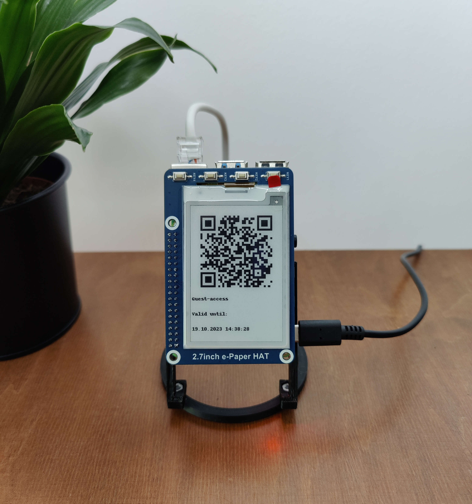

# Gapi4: Guest access point based on Raspberry Pi 4
Turns a Raspberry Pi 4 into a guest access point with periodic SSID + Password changes. The credentials are shown on an E-Ink display as a scannable QR-Code.
The QR-Code, SSID, Password and expiration date are optionally also visible from the local network via a simple webserver running on the Pi.


## Disclaimer
Install and use at your own risk. The code is provided "as-is" without any guarantee for security.

## How it works
A bridge (br0) between the ethernet interface (eth0) and the wifi interface (wlan0) of the Pi is created from which guests can access your network.
The wifi interface is put in AP-mode via hostapd.
A service (called gapi4.service) periodically changes the SSID and password of the access-point and restarts the hostapd service for the changes to take effect. The QR code containing the new credentials is then shown on the E-Ink display and optionally on a webserver accessible from the local network.
```
┌──────┐   eth0┌─────┐wlan0  ┌───────────┐
│Router├──┬────┤Gapi4├───────┤GuestDevice│
└──────┘  │    └─────┘       └───────────┘
          │
          │    ┌───────────┐
          └────┤LocalDevice│
               └───────────┘
```

## Configuration
The access point is configured by editing **gapi4.conf** (or **/etc/gapi4.conf** after installation):
```
ip: 192.168.XXX.XXX                 #Static address of the pi in the local network
refreshCredentialsSeconds: XXXX     #Refresh interval of the wifi credentials in seconds
enableWebServer: true/false         #enables/disables the webserver
```
If you change the settings after installation in **/etc/gapi4.conf**, make sure to restart the service for the changes to take effect:
```
sudo systemctl restart gapi4.service
```

## Installation
Assuming a Raspiberry Pi 4 with a clean install of Ubuntu Server 22.04.3 LTS and internet access, you just need to clone the repository and run the the installation script with root rights:
```
sudo ./install.sh
```
IMPORTANT: This will assign the static IP configured in **gapi4.conf**. You may lose the ssh connection as the Pi changes IP and need to reconnect using the configured IP.

## Advanced configuration

### Block access to devices in local network
If you dont want your guests to have access to devices on your local network (e.g. smarthome stuff or media servers), it is possible to configure the firewall of the Pi to drop/reject this traffic.

Reject any traffic recieved on wlan0 which should be forwarded and has a destination address in the IP-range 192.168.1.0 - 192.168.1.127:
```
    sudo iptables -A FORWARD -d 192.168.1.0/25 -m physdev --physdev-in wlan0 -j REJECT
```
To make these changes persist across reboots (requires iptables-persistent):
```
    sudo iptables-save > /etc/iptables/rules.v4
```
After that, any device on your network in the blocked IP-range can't be accessed anymore by devices connected through the wlan0 interface on the IP (which is the guest access point). Note that this also applies if the guest devices get assigned addresses in the blocked-range.